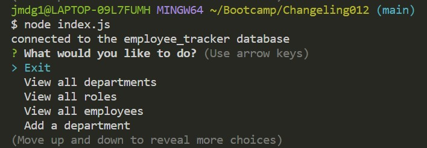

# Changeling012


```Changeling - A word of play for 'Challenging'```

```012 - Natural number following 011 (The previous challenge in this course)```

## Links to Repo and deployment📌

🔸 GitHub Repository [link](https://github.com/jmdg1023/Changeling012)


## User Story 👨

```http
AS A business owner
I WANT to be able to view and manage the departments, roles, and employees in my company
SO THAT I can organize and plan my business

```


## What this project does 💡💡💡
```
GIVEN a command-line application that accepts user input
WHEN I start the application
THEN I am presented with the following options: view all departments, view all roles, view all employees, add a department, add a role, add an employee, and update an employee role
WHEN I choose to view all departments
THEN I am presented with a formatted table showing department names and department ids
WHEN I choose to view all roles
THEN I am presented with the job title, role id, the department that role belongs to, and the salary for that role
WHEN I choose to view all employees
THEN I am presented with a formatted table showing employee data, including employee ids, first names, last names, job titles, departments, salaries, and managers that the employees report to
WHEN I choose to add a department
THEN I am prompted to enter the name of the department and that department is added to the database
WHEN I choose to add a role
THEN I am prompted to enter the name, salary, and department for the role and that role is added to the database
WHEN I choose to add an employee
THEN I am prompted to enter the employee’s first name, last name, role, and manager, and that employee is added to the database
WHEN I choose to update an employee role
THEN I am prompted to select an employee to update and their new role and this information is updated in the database
```


## Screenshot



## Learning Resources 🔗

🔸[Bootstrap](https://getbootstrap.com/)
🔸[Inquirer](https://www.npmjs.com/package/inquirer)
🔸[NPM Packages](https://www.npmjs.com/package/mysql2)


## License 📜

[](https://github.com/mecuboi/my-profile-website/blob/main/LICENSE)